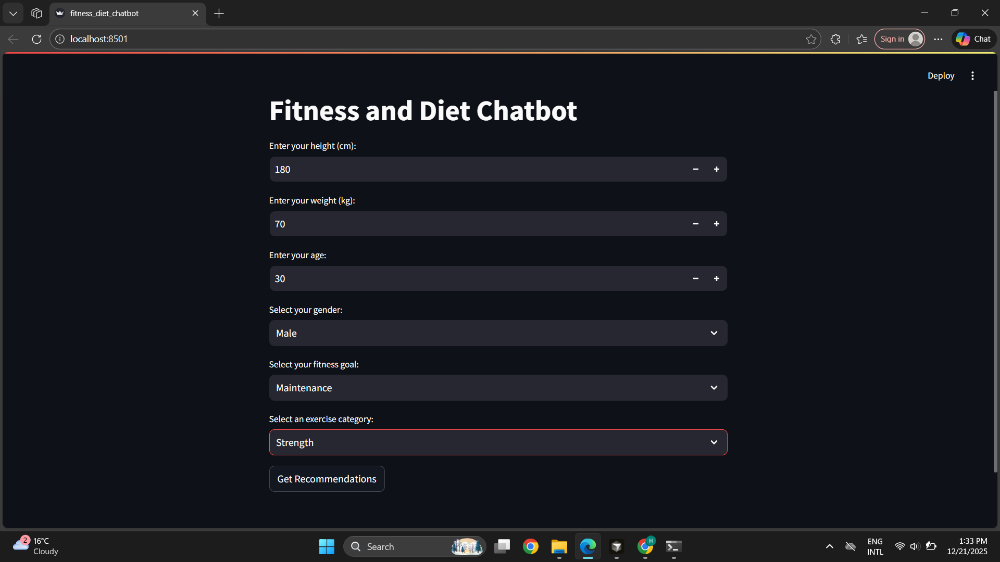
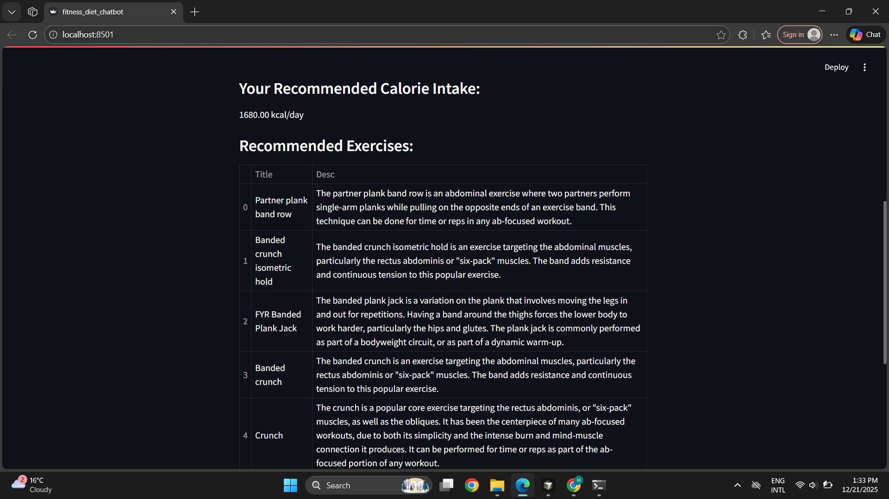
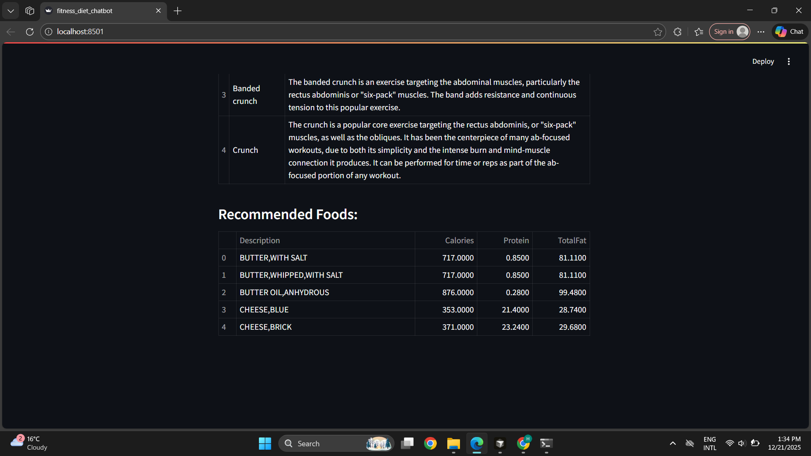

# Diet and Excercise Recommdation Chatbot

A personalized fitness and nutrition recommendation system powered by AI and data science. This web-based application provides users with customized exercise routines and dietary plans based on their biometric data, fitness goals, and preferences using advanced metabolic calculations and intelligent data filtering.

## 📋 Project Summary

This AI-powered fitness chatbot leverages machine learning principles and data analysis to deliver personalized health recommendations. The application calculates users' Basal Metabolic Rate (BMR) using the scientifically-proven Mifflin-St Jeor Equation, then generates tailored exercise and nutrition plans from comprehensive datasets containing thousands of exercises and food items. Built with Streamlit for an intuitive web interface, the system demonstrates practical application of data science in healthcare technology, showcasing skills in data manipulation, algorithmic problem-solving, and user-centric design.

## 🚀 Technologies Used

- **Python 3.8+** - Core programming language
- **Streamlit** - Web application framework for interactive UI
- **Pandas** - Data manipulation and analysis
- **NumPy** - Numerical computing and mathematical operations
- **CSV Data Processing** - Large-scale dataset handling

## ✨ Key Features

- **BMR Calculator**: Accurate metabolic rate calculation using Mifflin-St Jeor Equation
- **Personalized Calorie Recommendations**: Goal-based calorie adjustments (Weight Loss, Gain, Maintenance)
- **Exercise Database**: Access to comprehensive exercise library with filtering by category
- **Nutritional Analysis**: Smart food recommendations based on calorie limits and macronutrients
- **Interactive Web Interface**: User-friendly browser-based application
- **Data-Driven Insights**: Recommendations backed by extensive fitness and nutrition datasets

## 📸 Screenshots

### User Input Interface

*The application's clean and intuitive input interface where users enter their biometric information (height, weight, age, gender) and select their fitness goals. The interface uses Streamlit's native components for a seamless user experience, with validation and user-friendly controls.*

### Exercise Recommendations

*Personalized exercise recommendations displayed in a structured table format. The system filters through the exercise database based on user-selected categories (Strength, Cardio, Plyometrics, etc.) and presents relevant exercises with descriptions, helping users build effective workout routines.*

### Food Recommendations

*Nutritional recommendations showing foods that align with the user's calculated calorie needs. Each recommendation includes detailed nutritional information (calories, protein, total fat) to help users make informed dietary choices that support their fitness goals.*

## 📁 Project Structure

```
fitness_diet_chatbot/
│
├── fitness_diet_chatbot.py    # Main application file with Streamlit UI and core logic
├── requirements.txt            # Python dependencies and versions
├── README.md                   # Project documentation
├── .gitignore                  # Git ignore rules for Python projects
│
├── screenshots/                # Application screenshots for documentation
│   ├── input.png              # User input interface screenshot
│   ├── exercises.png          # Exercise recommendations screenshot
│   └── foods.png              # Food recommendations screenshot
│
├── megaGymDataset.csv         # Comprehensive exercise database
└── USDA.csv                   # USDA nutritional database
```

## 🛠️ Installation

### Prerequisites
- Python 3.8 or higher
- pip (Python package manager)

### Setup Instructions

1. **Clone the repository**
   ```bash
   git clone https://github.com/yourusername/fitness_diet_chatbot.git
   cd fitness_diet_chatbot
   ```

2. **Create a virtual environment** (recommended)
   ```bash
   python -m venv venv
   
   # On Windows
   venv\Scripts\activate
   
   # On macOS/Linux
   source venv/bin/activate
   ```

3. **Install dependencies**
   ```bash
   pip install -r requirements.txt
   ```

## 🎯 Usage

1. **Launch the application**
   ```bash
   streamlit run fitness_diet_chatbot.py
   ```

2. **Access the web interface**
   - The application will automatically open in your default browser
   - If not, navigate to `http://localhost:8501`

3. **Enter your information**
   - Input your height (cm), weight (kg), and age
   - Select your gender and fitness goal
   - Choose an exercise category preference

4. **Get recommendations**
   - Click "Get Recommendations" to receive personalized suggestions
   - Review your calculated calorie intake
   - Explore recommended exercises and foods

## 🔬 How It Works

1. **BMR Calculation**: The application uses the Mifflin-St Jeor Equation to calculate your Basal Metabolic Rate based on biometric inputs
2. **Goal Adjustment**: Calorie needs are adjusted based on your selected fitness goal (±500 kcal for weight changes)
3. **Data Filtering**: Advanced pandas operations filter exercise and food databases based on user preferences
4. **Recommendation Engine**: Top 5 relevant exercises and foods are selected and displayed in an organized format

## 📊 Datasets

- **megaGymDataset.csv**: Contains exercise information including types, body parts, titles, and descriptions
- **USDA.csv**: Comprehensive nutritional database with food descriptions, calories, protein, and fat content

## 🎓 Skills Demonstrated

- Data Science & Analysis
- Web Application Development
- Algorithm Implementation (BMR Calculation)
- Data Filtering & Processing
- User Interface Design
- Python Programming
- CSV Data Handling
- Mathematical Modeling

## 📝 License

This project is open source and available under the MIT License.

## 🤝 Contributing

Contributions, issues, and feature requests are welcome! Feel free to check the issues page.

## 👤 Author

**Muhammad Moeed Ikram**


